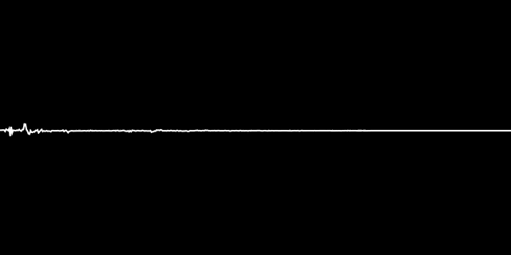

# WASM Fourier

  

#### Built using:  
`wasm-pack-template`: a template for starting a rust-wasm project to be used with wasm-pack  
`create-wasm-app`: npm init template for consuming rustwasm pkgs  
`rustfft`: a mixed-radix FFT implementation written in Rust  
`D3.js`: a JavaScript library for visualizing data using web standards
